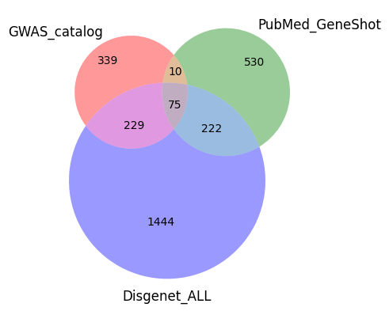
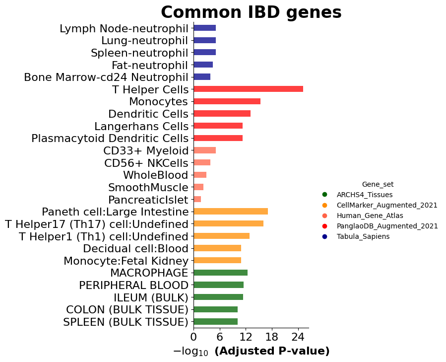

## Project Overview

This project focuses on data mining of genes related to various inflammatory bowel diseases using multiple databases. The main objective is to identify genes associated with different pathologies, determine the overlap between these genes across databases, and perform an overrepresentation analysis using cell and tissue type markers from the Human Cell Atlas to prioritise genes and cell types.

## Structure

- **Data**: Contains raw and processed data used for analysis.
- **Figures**: Includes visualizations and plots generated from the analysis.
- **Notebooks**: Jupyter notebooks for data ingestion and preliminary analysis.
- **Results**: Summary of results, including tables and reports.

## Data
- `C0010346_disease_gda_summary`: Genetic disease associations for the term Crohn's Disease (C0010346) extracted from disgenet database.
- `Xenium_hColon_v1_metadata`: Genes contained in *Xenium Human Colon Gene Expression Panel*.
- `colon_high_expression_HPA`: High expression genes in colon according to the Human protein Atlas (HPA).
- `EFO_0003767_associations_export_IBD`: genes associated with IBD-related SNPs (EFO_0003767) in GWAS catalog.

## Notebooks

The `notebooks` directory contains Jupyter notebooks for data ingestion from various databases:

- `IBD_celltypes:` use of the cellxgene census software of the [Chan Zuckerberg initiative](https://chanzuckerberg.github.io/cellxgene-census/). **Incomplete**.
- `IBD_disgenetAPI_review:` Analysis using [Disgenet API](https://www.disgenet.org/). Cross-reference data with HPA and GWAS catalog to obtain the common subset. Observe overlap with the genes contained in the panel and perform enrichment analysis.
- `IBD_geneshotAPI_review:` Analysis using [Geneshot API](https://maayanlab.cloud/geneshot/api.html) from Maayan Lab. Genes related to the disease, extracted from the pubmed literature.
- `IBD_overlap:` Overlap analysis on the data extracted from HPA with Xenium colon panel.

### Data Extraction and Analysis workflow

1. **Data Ingestion**:
   - **DisGeNET**: Retrieve gene-disease associations using the DisGeNET API.
   - **GeneShot**: Retrieve pubmed gene-disease co-ocurrencies using the GeneShot API.
   - **GWAS Catalog**: Download and process CSV files containing SNP-gene-disease associations.
   - **HPA**: Download and process TSV files containing highly expressed genes in human colon.

2. **Gene Overlap Analysis**:
   - Determine the degree of overlap between genes extracted from the different databases.
   
3. **Overrepresentation Analysis**:
   - Perform overrepresentation analysis using different datasets and databases of cell type and tissue expression markers:
   *Human_Gene_Atlas, Tabula_Sapiens, PanglaoDB_Augmented_2021, CellMarker_Augmented_2021, ARCHS4_Tissues*

## Results

A set of 75 genes represented in the 3 databases used was obtained.

These genes are not contained in the pre-designed 10x colon Xenium panel

Of these 75 genes, NOD2 is by far the most studied in the literature.

This subset of genes seems to be especially related to T-helper lymphocytes and monocytes. These cell types are mostly present in the blood, so it makes sense that the main tissue involved is the peripheral blood over different parts of the gut.

## Getting Started

To get started with this project, clone the repository and navigate to the `notebooks` directory to explore the data ingestion and analysis notebooks.

## Contributing
Contributions are welcome! Please open an issue or submit a pull request for any enhancements or bug fixes.

## License
This project is licensed under the [GPL License](LICENSE.GPL).
